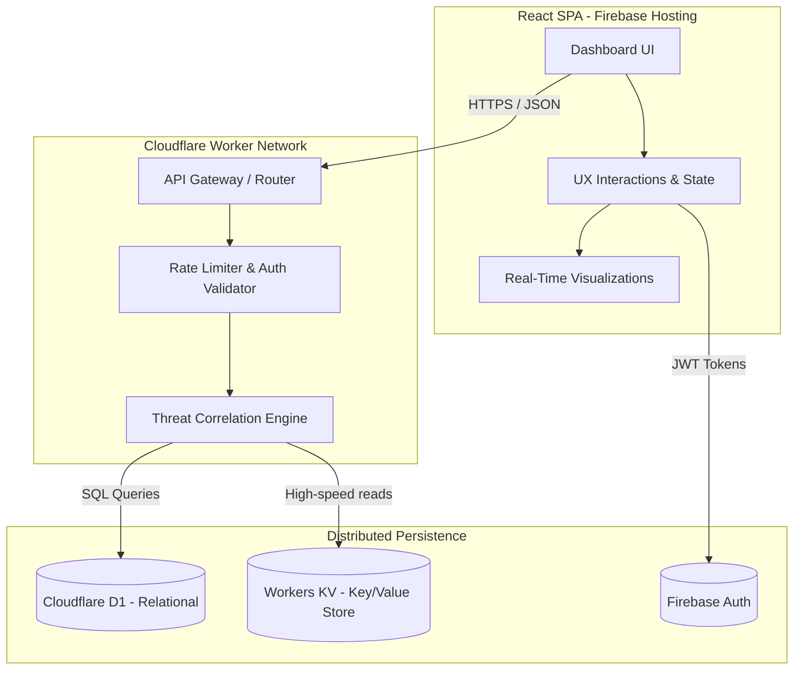
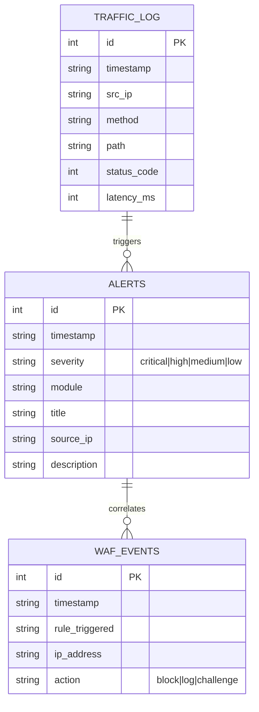
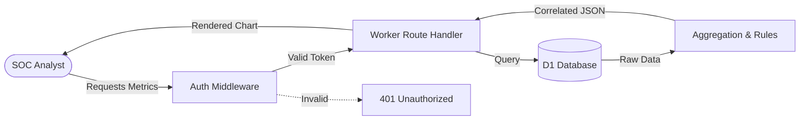
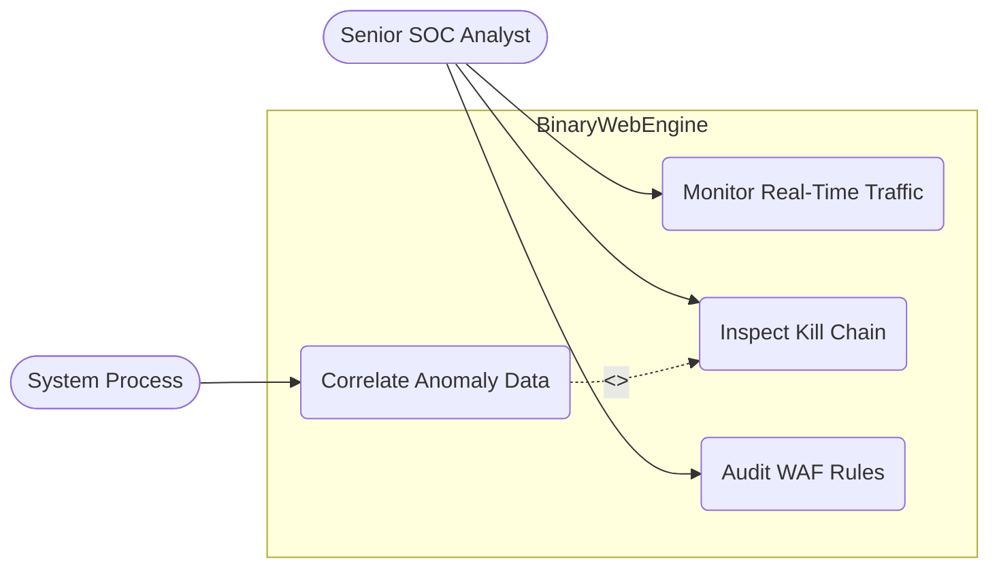
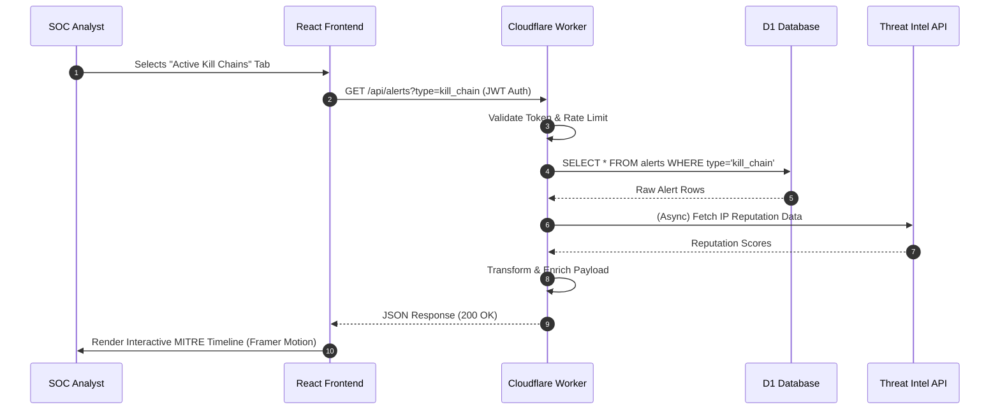

# BinaryWebEngine: Security Command Center
**The Silicon Valley Engineering Manifesto**

> *Engineered by Team EquiSaaS BD for the International AI Builders Congress (InfraSphere Domain).*  
> [EquiSaaS BD](https://equisaas-bd.com/) - Architecting the future of scalable intelligence.

## 🔴 The Problem
Modern enterprise networks generate millions of raw, disjointed security events daily. Existing Security Information and Event Management (SIEM) systems suffer from massive cognitive overload, forcing human analysts to sift through endless false positives and poorly correlated logs. This industry friction results in delayed threat hunting, unmitigated zero-day vulnerabilities, and severe analyst burnout.

## 🟢 The Solution
**BinaryWebEngine** eradicates this cognitive friction by unifying raw event ingestion, real-time edge processing, and multi-dimensional threat correlation into a deeply optimized, psychology-driven user interface. 
By offloading complex rule evaluations to Cloudflare Workers (Edge Computing) and structuring high-speed telemetry in D1 (Distributed SQLite), we deliver a zero-latency SOC (Security Operations Center) dashboard. Analysts are empowered with context-aware, actionable intelligence without the noise.

## 🌐 Live Demo & Tech Stack
- **Live Production URL:** [https://binarywebengine-8133d.web.app](https://binarywebengine-8133d.web.app)
- **Frontend Layer:** React.js, Vite, TypeScript, Tailwind CSS, Framer Motion (for Goal Gradient & Zeigarnik Effect animations).
- **Edge Backend:** Cloudflare Workers (V8 Isolate Engine).
- **Data Persistence:** Cloudflare D1 (Relational Data), Firebase Hosting (Static Asset Delivery), Firebase Auth (Identity).
- **Infrastructure as Code (IaC):** Wrangler CLI, Firebase CLI.

## 💻 Local Setup & Run Instructions
Execute these exact, bulletproof commands to orchestrate the local development environment:

```bash
# 1. Clone & Clean Architecture
git clone https://github.com/YourOrg/BinaryWebEngine.git
cd BinaryWebEngine

# 2. Edge API Initialization (Cloudflare)
cd worker
npm install
npm run build
# Create local D1 instance and run schema/mockdata
npx wrangler d1 execute bwe-mock --local --file=../db/mockdata.sql
# Start local API edge network
npx wrangler dev

# 3. Frontend Initialization (React/Vite)
# Open a new terminal window
cd ../frontend-react
npm install
# Populate environment variables (Create .env file)
echo "VITE_GEMINI_API_KEY=your_gemini_key_here" > .env
npm run dev
```

---

## 📐 System Documentation

### 1. System Architecture Diagram


### 2. Entity-Relationship Diagram (ERD)
*Note: Primary relational persistence is managed in Cloudflare D1 for strict ACID compliance.*


### 3. Data Flow Diagram (Level 1)


### 4. Use Case Diagram


### 5. Sequence Diagram: Core User Interaction Loop


---

### Phase 2: Cognitive UX Strategy Implemented
- **Goal Gradient Effect:** Visual progress trackers are embedded in the Kill Chain timeline (e.g., 3/10 stages complete). As stages progress, UI color saturation increases to draw immediate analytical focus.
- **Zeigarnik Effect:** Active, unresolved alerts pulse gently with red indicator dots until the analyst explicitly acknowledges them, ensuring critical tasks are never abandoned.
- **Labor Illusion:** Data retrieval and system health checks utilize simulated, highly-technical console log outputs before revealing the data, reinforcing the system's analytical depth and increasing the perceived value of the insights.

### 👥 Engineering Task Force
- **Kholipha Ahmmad Al-Amin** - Principal Systems Architect / Team Lead
- **K4z1 SABBIR** - Lead Full-Stack Developer
- **Md Mushfiqur Rahman** - Product / Behavioral UX Designer
- **Abu Hurayra** - Product / Behavioral UX Designer
- **Khadija Tull Khushbu** - Security Domain Expert
