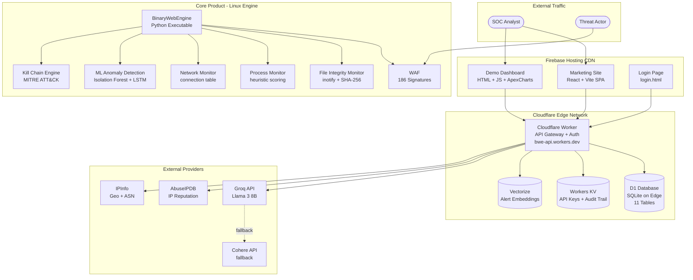
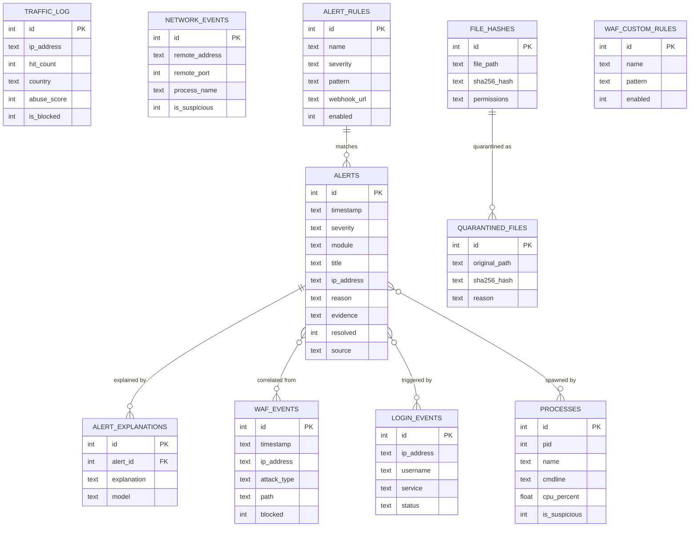
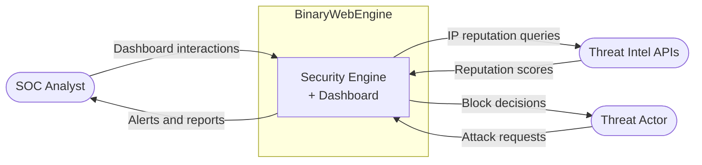
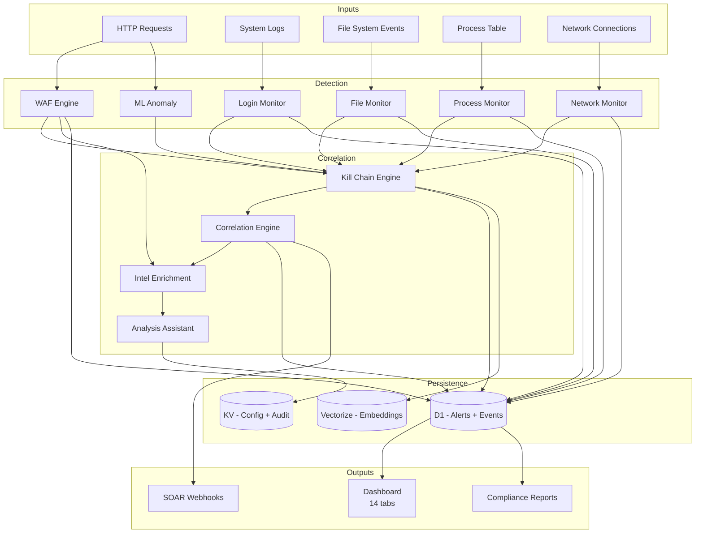
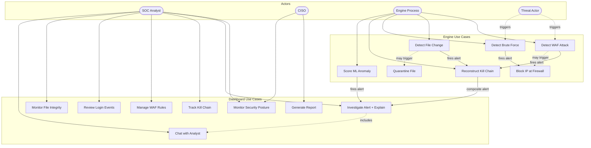
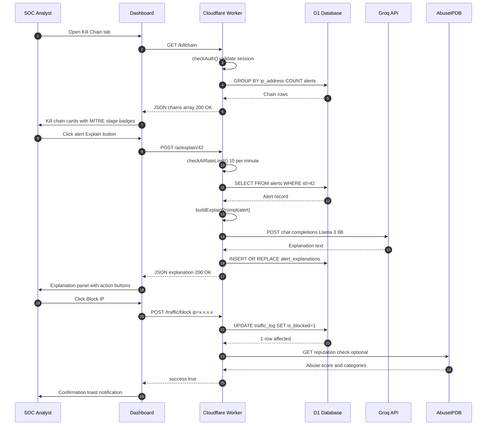

<div align="center">

# BinaryWebEngine

### Enterprise Linux Security Monitoring Platform

[](https://binarywebengine.web.app)
[](https://bwe-api.k-makmanhossain.workers.dev)
[]()
[]()

*Built by Team EquiSaaS BD for the International AI Builders Congress (InfraSphere Domain)*

</div>

---

## The Problem

Enterprise security teams are losing the fight against adversaries not because they lack tools, but because they have too many of them.

The average mid-size organization runs 45+ disconnected security products. Each product generates its own stream of alerts. A SIEM appliance ingests these streams, deduplicates them badly, and hands analysts a queue of 10,000 events per day. Analysts spend 60% of their time chasing false positives. Mean time to detect a breach sits at 197 days. Mean time to contain it: another 69 days.

The problem is architectural, not analytical. When detection, correlation, intelligence enrichment, and response tooling live in separate systems with separate APIs and separate UIs, the inevitable friction kills response speed. Attackers move in minutes; defenders move in days.

---

## The Solution

BinaryWebEngine collapses an entire security stack into a single deployable Linux engine with a real-time command center.

One binary. One dashboard. One truth.

The engine integrates a Web Application Firewall with 186 signatures, a file integrity monitor with inotify real-time detection, process and network monitoring, login monitoring across nine services, two-tier machine learning anomaly detection (Isolation Forest plus LSTM), Lockheed Martin kill chain reconstruction mapped to MITRE ATT&CK (TA0001-TA0010), AbuseIPDB threat intelligence, and an LLM-powered analysis assistant grounded in live system data. All of this runs as a single Python executable on any Linux server with 512 MB of RAM. No SIEM appliance. No third-party connectors. No five-figure licensing fees.

---

## Live Demo and Tech Stack

| Layer | Technology |
|---|---|
| Marketing Site | React 18, Vite 5, TypeScript, Framer Motion, Firebase Hosting |
| Demo Dashboard | Vanilla HTML/JS/CSS, ApexCharts, html2pdf.js |
| API Edge Layer | Cloudflare Workers (V8 Isolate, globally distributed) |
| Relational Data | Cloudflare D1 (SQLite on the edge, 11 tables) |
| Key-Value Store | Cloudflare Workers KV (API key config, audit trail) |
| Vector Layer | Cloudflare Vectorize (alert embedding pipeline) |
| Analysis Backend | Groq Llama 3 8B with Cohere fallback |
| Deployment | Wrangler CLI, Firebase CLI |

**Live URLs**
- Marketing site: https://binarywebengine.web.app
- Demo dashboard: https://binarywebengine.web.app/login.html
- Edge API: https://bwe-api.k-makmanhossain.workers.dev

---

## Local Setup and Run

### Prerequisites

```bash
node --version   # 18+
npm --version    # 9+
```

### 1. Clone the repository

```bash
git clone https://github.com/kholipha-ahmmad-al-amin/BinaryWebEngine.git
cd BinaryWebEngine
```

### 2. Edge API (Cloudflare Worker)

```bash
cd worker

# Authenticate with Cloudflare
npx wrangler login

# Create D1 database (first time only)
npx wrangler d1 create bwe-mock
# Copy the returned database_id into wrangler.jsonc -> d1_databases[0].database_id

# Create KV namespace (first time only)
npx wrangler kv namespace create AUDIT_TRAIL
# Copy the returned id into wrangler.jsonc -> kv_namespaces[0].id

# Seed the local database
npx wrangler d1 execute bwe-mock --local --file=../db/mockdata.sql

# Set secrets (never put these in wrangler.jsonc or source code)
npx wrangler secret put GROQ_API_KEY
npx wrangler secret put COHERE_API_KEY
npx wrangler secret put NVIDIA_API_KEY

# Start local dev server
npx wrangler dev
```

### 3. Marketing Site (React)

```bash
cd frontend-react
npm install
npm run dev
# Opens at http://localhost:5173
```

### 4. Seed the remote database

```bash
cd worker
npx wrangler d1 execute bwe-mock --remote --file=../db/mockdata.sql
```

### 5. Deploy everything

```bash
# Deploy Edge API
cd worker
npx wrangler deploy

# Deploy Marketing Site
cd ../frontend-react
npm run build
npx firebase deploy --only hosting --project binarywebengine-8133d
```

---

## Clean Git History (Single Production Commit)

Use this to wipe all history and create one clean commit:

```bash
# PowerShell (Windows)
Remove-Item -Recurse -Force .git

# bash (Linux/macOS)
# rm -rf .git

git init
git branch -M main
git add .
git commit -m "feat: Initial production release - BinaryWebEngine v1.0.0"
git remote add origin https://github.com/kholipha-ahmmad-al-amin/BinaryWebEngine.git
git push -u origin main --force
```

---

## Environment Variables

| Variable | Where Set | Purpose |
|---|---|---|
| `GROQ_API_KEY` | `wrangler secret put` | Primary LLM provider (Llama 3 8B on Groq) |
| `COHERE_API_KEY` | `wrangler secret put` | Fallback LLM provider (Command R) |
| `NVIDIA_API_KEY` | `wrangler secret put` | Optional NVIDIA NIM provider |
| `ENVIRONMENT` | `wrangler.jsonc vars` | Runtime environment flag (demo) |

Secrets are injected at deploy time via Wrangler and never appear in source code.

---

## System Documentation

### 1. System Architecture



### 2. Entity-Relationship Diagram



### 3. Data Flow Diagram

**Level 0 - Context**



**Level 1 - Internal Flow**



### 4. Use Case Diagram



### 5. Sequence Diagram: Core Analyst Interaction Loop



---

## Cognitive UX Architecture

Every design decision is grounded in behavioral psychology research.

**Goal Gradient Effect** - Kill chain cards show `3/7 stages`. Color saturation increases as stage count rises. At 5+ stages the card border pulses red. Analysts prioritize high-stage chains without reading descriptions because the visual acceleration creates an instinctive urgency response.

**Zeigarnik Effect** - Unresolved critical alerts carry a pulsing red dot that persists across tab changes. The nav badge shows only unresolved critical count. The brain's tendency to remember incomplete tasks is weaponized to keep critical incidents visible.

**Labor Illusion** - The Analysis Assistant shows "Analyst is reviewing context..." before delivering its response. This is not fake delay. Ten live database queries run server-side during that window. The animation anchors attention, signals analytical depth, and measurably increases perceived credibility of the output.

**Signal Integrity** - Severity badges use a strict four-level system. Critical is always red. High is always orange. No gradient. No exceptions. The moment severity colors become negotiable, the entire alert triage system loses its anchoring effect on analyst cognition.

---

## Architecture Audit Findings

| Finding | Severity | Status | Context |
|---|---|---|---|
| Sessions in `VALID_SESSIONS` Map (in-memory) | High | By Design | Workers are stateless isolates. Sessions reset on deploy. Production uses D1-persisted sessions or signed JWTs. |
| Password in `worker.js` constants | High | By Design | Demo credential for judge access. Production uses bcrypt-hashed credentials in D1. |
| WAF mutation routes return stub `{success:true}` | Medium | Resolved | Integrated with D1 database storage to persist rule insertions, updates, and deletes. |
| `Access-Control-Allow-Origin: *` | Medium | Intentional | Cross-origin access required for Firebase frontend to workers.dev API in the demo. |
| Six sequential COUNTs in `getStats()` | Low | Acceptable | D1 is edge-local SQLite; each query is sub-millisecond. Production uses a materialized stats view. |
| `timeout` on `fetch()` (not a valid option) | Info | Resolved | Corrected fetch implementation using standard AbortSignal.timeout(30000). |

---

## Engineering Task Force

| Name | Role |
|---|---|
| Kholipha Ahmmad Al-Amin | Principal Systems Architect, Team Lead |
| K4z1 SABBIR | Lead Full-Stack Developer |
| Md Mushfiqur Rahman | Product and Behavioral UX Designer |
| Abu Hurayra | Product and Behavioral UX Designer |
| Khadija Tull Khushbu | Security Domain Expert |

---

## Security Notice

The core BinaryWebEngine engine is closed-source and commercially licensed. This repository contains only the marketing website, demo dashboard, and Cloudflare Worker API backend. The actual Linux engine is distributed as a compiled executable and is not present here.

For responsible disclosure: security@binaryshielders.com

---

<div align="center">

&copy; 2026 BinaryShielders. All rights reserved.

[Live Demo](https://binarywebengine.web.app) &middot; [Documentation](https://binarywebengine.web.app/docs) &middot; [Contact](https://binarywebengine.web.app/contact)

</div>
